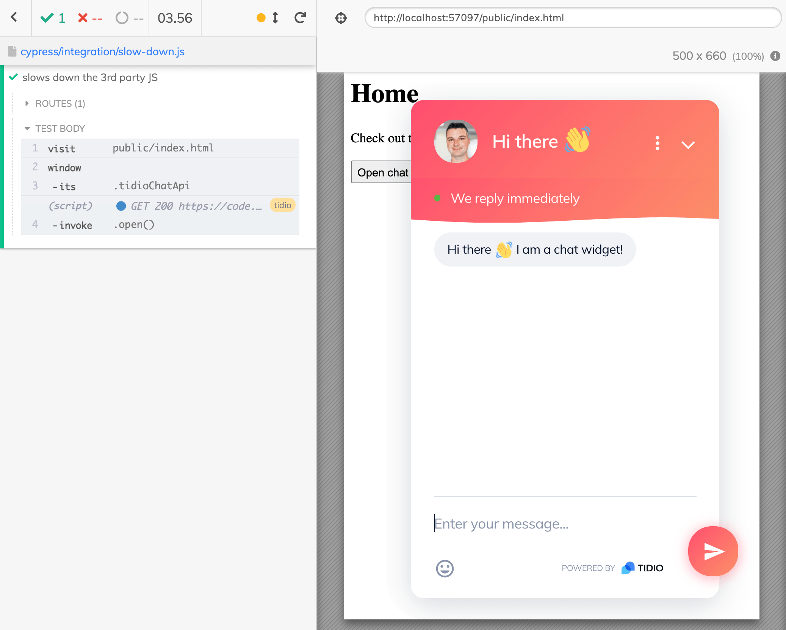

# cypress-3rd-party-script-example 
> Example waiting for 3rd party JavaScript library to load before testing the page

The page from `public` is deployed to [https://glebbahmutov.com/cypress-3rd-party-script-example/](https://glebbahmutov.com/cypress-3rd-party-script-example/) and has a [Tidio](https://www.tidio.com/) chat widget

## Specs

- [slow-down.js](./cypress/integration/slow-down.js) uses [cy.intercept](https://on.cypress.io/intercept) to slow down 3rd party JavaScript resource. It waits for the intercept to happen, hoping that 3rd party chat widget is ready after that.
- [wait-for-chat-object.js](./cypress/integration/wait-for-chat-object.js) waits for the `window.tidioChatApi` property to exist before proceeding. The property is added by the chat code, thus we know it is ready.
- [invoke-open.js](./cypress/integration/invoke-open.js) shows how the test code can call directly the chat object methods, even if the object was created by the application.
- [spy-on-open.js](./cypress/integration/spy-on-open.js) spies on the application calling `tidioChatApi.open()` to confirm it was called once without any arguments.

## Videos

- [Slow Down And Wait For 3rd Party JavaScript To Load](https://youtu.be/MzCACth7qLE)
- [Spy On The Application Calling 3rd Party Library Code](https://youtu.be/5SBjkrKwhIA)

## Small print

Author: Gleb Bahmutov &lt;gleb.bahmutov@gmail.com&gt; &copy; 2021

- [@bahmutov](https://twitter.com/bahmutov)
- [glebbahmutov.com](https://glebbahmutov.com)
- [blog](https://glebbahmutov.com/blog)
- [videos](https://www.youtube.com/glebbahmutov)
- [presentations](https://slides.com/bahmutov)
- [cypress.tips](https://cypress.tips)

License: MIT - do anything with the code, but don't blame me if it does not work.
